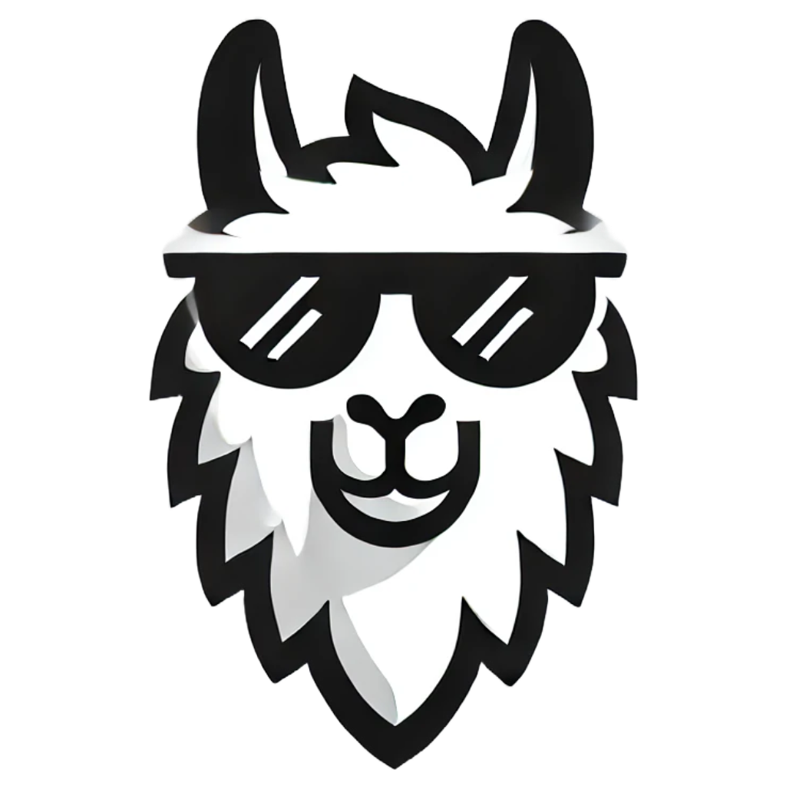

<a id="readme-top"></a>

<!-- PROJECT SHIELDS -->

[![Contributors][contributors-shield]][contributors-url]
[![Forks][forks-shield]][forks-url]
[![Stargazers][stars-shield]][stars-url]
[![Issues][issues-shield]][issues-url]
[![project_license][license-shield]][license-url]
[![LinkedIn][linkedin-shield]][linkedin-url]

<!-- PROJECT LOGO -->
<br />
<div align="center">
  <a href="https://github.com/buiducnhat/ollamazing">
    
  </a>

<h3 align="center">Ollamazing</h3>

  <p align="center">
    A Web extension to use Ollama
    <br />
    <a href="https://github.com/buiducnhat/ollamazing"><strong>Explore the docs »</strong></a>
    <br />
    <br />
    <a href="https://github.com/buiducnhat/ollamazing">View Demo</a>
    &middot;
    <a href="https://github.com/buiducnhat/ollamazing/issues/new?labels=bug&template=bug-report---.md">Report Bug</a>
    &middot;
    <a href="https://github.com/buiducnhat/ollamazing/issues/new?labels=enhancement&template=feature-request---.md">Request Feature</a>
  </p>
</div>

<!-- TABLE OF CONTENTS -->
<details>
  <summary>Table of Contents</summary>
  <ol>
    <li>
      <a href="#about-the-project">About The Project</a>
      <ul>
        <li><a href="#built-with">Built With</a></li>
      </ul>
    </li>
    <li>
      <a href="#getting-started">Getting Started</a>
      <ul>
        <li><a href="#prerequisites">Prerequisites</a></li>
        <li><a href="#installation">Installation</a></li>
      </ul>
    </li>
    <li><a href="#usage">Usage</a></li>
    <li><a href="#roadmap">Roadmap</a></li>
    <li><a href="#contributing">Contributing</a></li>
    <li><a href="#license">License</a></li>
    <li><a href="#contact">Contact</a></li>
  </ol>
</details>

<!-- ABOUT THE PROJECT -->

## About The Project

![Ollamazing Demo][product-demo]

<p align="right">(<a href="#readme-top">back to top</a>)</p>

### Built With

- [![WXT][WXT]][WXT-url]
- [![React][React.js]][React-url]
- [![TailwindCSS][TailwindCSS]][TailwindCSS-url]
- [![Shadcn][Shadcn]][Shadcn-url]
- [![Tanstack Query][Tanstack Query]][Tanstack Query-url]
- [![Valtio][Valtio]][Valtio-url]
<p align="right">(<a href="#readme-top">back to top</a>)</p>

<!-- GETTING STARTED -->

## Getting Started

This extension is built using `WXT` and `React`, so ensure to install `Node.Js` or `Bun` for a running environment.

### Prerequisites

- **Package manager**: We can use any package managers like `npm`, `yarn`, `pnpm`, `bun`. This project is currently installed by `npm`, that the field `package-lock.json` exists.
- **Ollama**: This extension uses `Ollama`, so you have to have a `Ollama` server from anywhere, installing on local for example. For more details, read [Ollama](https://github.com/buiducnhat/ollama).

### Installation

1. Clone the repo
   ```sh
   git clone https://github.com/buiducnhat/ollamazing.git
   ```
2. Install dependencies
   ```sh
   npm install
   # or yarn install, pnpm install, bun install
   ```

<p align="right">(<a href="#readme-top">back to top</a>)</p>

<!-- USAGE EXAMPLES -->

## Usage

To run local development, run the following command:

```sh
npm run dev
# or yarn run dev, pnpm run dev, bun run dev
```

then, a new browser window will open with the extension installed.

<p align="right">(<a href="#readme-top">back to top</a>)</p>

<!-- ROADMAP -->

## Roadmap

- [x] Basic, chat with AI assistant.
- [x] Improve UI, UX.
  - [x] Adapt for almost popular models's message format.
  - [ ] Interact with images.
- [ ] More settings like theme, language.
- [ ] Manage model, use more Ollama APIs.
- [ ] Content script to be injected into the pages.
  - [ ] Add utility when user select text in the page.
  - [ ] Add context menu to translate text, or define a word.

See the [open issues](https://github.com/buiducnhat/ollamazing/issues) for a full list of proposed features (and known issues).

<p align="right">(<a href="#readme-top">back to top</a>)</p>

<!-- CONTRIBUTING -->

## Contributing

Contributions are what make the open source community such an amazing place to learn, inspire, and create. Any contributions you make are **greatly appreciated**.

If you have a suggestion that would make this better, please fork the repo and create a pull request. You can also simply open an issue with the tag "enhancement".
Don't forget to give the project a star! Thanks again!

1. Fork the Project
2. Create your Feature Branch (`git checkout -b feature/AmazingFeature`)
3. Commit your Changes (`git commit -m 'Add some AmazingFeature'`)
4. Push to the Branch (`git push origin feature/AmazingFeature`)
5. Open a Pull Request

<p align="right">(<a href="#readme-top">back to top</a>)</p>

### Top contributors:

<a href="https://github.com/buiducnhat/ollamazing/graphs/contributors">
  
</a>

<!-- LICENSE -->

## License

Distributed under the MIT License. See `LICENSE.txt` for more information.

<p align="right">(<a href="#readme-top">back to top</a>)</p>

<!-- CONTACT -->

## Contact

Bùi Đức Nhật - nhaths4701@gmail.com

Project Link: [https://github.com/buiducnhat/ollamazing](https://github.com/buiducnhat/ollamazing)

<p align="right">(<a href="#readme-top">back to top</a>)</p>

<!-- MARKDOWN LINKS & IMAGES -->
<!-- https://www.markdownguide.org/basic-syntax/#reference-style-links -->

[contributors-shield]: https://img.shields.io/github/contributors/buiducnhat/ollamazing.svg?style=for-the-badge
[contributors-url]: https://github.com/buiducnhat/ollamazing/graphs/contributors
[forks-shield]: https://img.shields.io/github/forks/buiducnhat/ollamazing.svg?style=for-the-badge
[forks-url]: https://github.com/buiducnhat/ollamazing/network/members
[stars-shield]: https://img.shields.io/github/stars/buiducnhat/ollamazing.svg?style=for-the-badge
[stars-url]: https://github.com/buiducnhat/ollamazing/stargazers
[issues-shield]: https://img.shields.io/github/issues/buiducnhat/ollamazing.svg?style=for-the-badge
[issues-url]: https://github.com/buiducnhat/ollamazing/issues
[license-shield]: https://img.shields.io/github/license/buiducnhat/ollamazing.svg?style=for-the-badge
[license-url]: https://github.com/buiducnhat/ollamazing/blob/master/LICENSE.txt
[linkedin-shield]: https://img.shields.io/badge/-LinkedIn-black.svg?style=for-the-badge&logo=linkedin&colorB=555
[linkedin-url]: https://linkedin.com/in/buiducnhat
[product-demo]: docs/demo.gif
[WXT]: https://img.shields.io/badge/wxt-black?style=for-the-badge&logo=wxt
[WXT-url]: https://wxt.dev/
[React.js]: https://img.shields.io/badge/React-20232A?style=for-the-badge&logo=react&logoColor=61DAFB
[React-url]: https://reactjs.org/
[TailwindCSS]: https://img.shields.io/badge/tailwindcss-black?style=for-the-badge&logo=tailwindcss
[TailwindCSS-url]: https://tailwindcss.com/
[Shadcn]: https://img.shields.io/badge/shadcn-black?style=for-the-badge&logo=shadcnui
[Shadcn-url]: https://ui.shadcn.com/
[Tanstack Query]: https://img.shields.io/badge/tanstackquery-black?style=for-the-badge&logo=reactquery
[Tanstack Query-url]: https://tanstack.com/query
[Valtio]: https://img.shields.io/badge/valtio-gray?style=for-the-badge&logo=data:image/png;base64,iVBORw0KGgoAAAANSUhEUgAAADAAAAAwCAIAAADYYG7QAAABB0lEQVR4nOyVwYmGMBCFdxfRDkK85WQzerACG0kbViA24N0OrMACLEAN6MXs3twgyz7dgWV+mO/mY5x8IRPy8cYMEUKIEEKEECKEECGECCHYCUXE/621Sqnfa4ZhaNuWuNBdxnH8RDRNc78huyMTIQQ7IeotK4oijuMw0Vr3ff8fQtbaqqrCJM/zuq6NMWfinCvL8s82z4SUUlmWhUmSJMaYMFyWhWLDcYZECPFghvZ9v4zIcRzOuTBc19V7fynbtu3+Ku/3S38kTdMo+t6V936aJmJPEpfHdZ5nYkN2MyRCCHZC1Me16zqt9fn56Ia/BuyOTIQQIoQQIYQIIUQIIUKIrwAAAP//7BxzdBirqlAAAAAASUVORK5CYII=
[Valtio-url]: https://valtio.dev/
